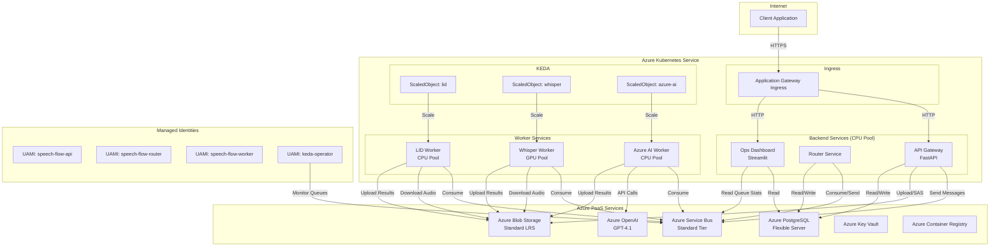

# Speech Flow Implementation & Deployment Guide

## Table of Contents
1. [Component Architecture](#1-component-architecture)
2. [Identity & Access Management](#2-identity--access-management)
3. [Azure Infrastructure Setup](#3-azure-infrastructure-setup)
4. [Kubernetes Deployment](#4-kubernetes-deployment)
5. [Automated Deployment](#5-automated-deployment)
6. [Configuration Reference](#6-configuration-reference)
7. [Deployment Checklist](#7-deployment-checklist)

---

## 1. Component Architecture

### 1.1 High-Level Component Diagram

```
┌─────────────────────────────────────────────────────────────────────────────────────────┐
│                                    AZURE KUBERNETES SERVICE (AKS)                        │
│  ┌─────────────────────────────────────────────────────────────────────────────────────┐ │
│  │                              Namespace: speech-flow                                  │ │
│  │                                                                                      │ │
│  │  ┌──────────────────┐     ┌──────────────────┐     ┌──────────────────┐            │ │
│  │  │   API Gateway    │     │  Router Service  │     │    Dashboard     │            │ │
│  │  │    (FastAPI)     │     │  (Event-Driven)  │     │   (Streamlit)    │            │ │
│  │  │                  │     │                  │     │                  │            │ │
│  │  │  UAMI: api-id    │     │  UAMI: router-id │     │  UAMI: dash-id   │            │ │
│  │  └────────┬─────────┘     └────────┬─────────┘     └────────┬─────────┘            │ │
│  │           │                        │                        │                       │ │
│  │           │ HTTP                   │ Events                 │ SQL                   │ │
│  │           ▼                        ▼                        ▼                       │ │
│  │  ┌──────────────────────────────────────────────────────────────────────────────┐  │ │
│  │  │                         AZURE SERVICE BUS                                     │  │ │
│  │  │  ┌─────────────┐ ┌─────────────┐ ┌─────────────┐ ┌─────────────┐             │  │ │
│  │  │  │ job-events  │ │  lid-jobs   │ │whisper-jobs │ │azure-ai-jobs│             │  │ │
│  │  │  └──────┬──────┘ └──────┬──────┘ └──────┬──────┘ └──────┬──────┘             │  │ │
│  │  └─────────┼───────────────┼───────────────┼───────────────┼────────────────────┘  │ │
│  │            │               │               │               │                       │ │
│  │            ▼               ▼               ▼               ▼                       │ │
│  │  ┌──────────────┐ ┌──────────────┐ ┌──────────────┐ ┌──────────────┐              │ │
│  │  │    Router    │ │  LID Worker  │ │Whisper Worker│ │Azure AI      │              │ │
│  │  │   Service    │ │              │ │   (GPU)      │ │   Worker     │              │ │
│  │  │              │ │  UAMI:       │ │              │ │              │              │ │
│  │  │ UAMI:        │ │  worker-id   │ │  UAMI:       │ │  UAMI:       │              │ │
│  │  │ router-id    │ │              │ │  worker-id   │ │  worker-id   │              │ │
│  │  └──────────────┘ └──────────────┘ └──────────────┘ └──────────────┘              │ │
│  │        │                 │               │               │                        │ │
│  │        │ KEDA            │ KEDA          │ KEDA          │ KEDA                   │ │
│  │        │ ScaledObject    │ ScaledObject  │ ScaledObject  │ ScaledObject           │ │
│  │                                                                                    │ │
│  └────────────────────────────────────────────────────────────────────────────────────┘ │
└─────────────────────────────────────────────────────────────────────────────────────────┘
                    │                   │                   │
                    ▼                   ▼                   ▼
    ┌───────────────────┐   ┌───────────────────┐   ┌───────────────────┐
    │  Azure Blob       │   │  Azure PostgreSQL │   │  Azure OpenAI     │
    │  Storage          │   │  Flexible Server  │   │  Service          │
    │                   │   │                   │   │                   │
    │  Containers:      │   │  Tables:          │   │  Deployments:     │
    │  - audio-files    │   │  - jobs           │   │  - gpt-4.1        │
    │  - results        │   │  - job_steps      │   │  - whisper (opt)  │
    │                   │   │  - daily_metrics  │   │                   │
    └───────────────────┘   └───────────────────┘   └───────────────────┘
```

### 1.2 Detailed Connection Diagram



### 1.3 Data Flow Diagram

```
┌─────────────────────────────────────────────────────────────────────────────────────┐
│                              DATA FLOW: Full Pipeline                                │
└─────────────────────────────────────────────────────────────────────────────────────┘

 Step 1: Job Submission
 ──────────────────────
 Client ──POST /jobs──▶ API Gateway ──INSERT──▶ PostgreSQL (jobs table)
                              │
                              └──Generate SAS URL──▶ Return to Client

 Step 2: Audio Upload
 ────────────────────
 Client ──PUT (SAS)──▶ Azure Blob Storage (audio-files/{job_id}/{filename})

 Step 3: Start Processing
 ────────────────────────
 Client ──POST /jobs/{id}/start──▶ API Gateway ──Send Message──▶ Service Bus (job-events)

 Step 4: Router Orchestration
 ────────────────────────────
 Service Bus (job-events) ──Message──▶ Router ──Dispatch──▶ Service Bus (lid-jobs)
                                          │
                                          └──INSERT──▶ PostgreSQL (job_steps)

 Step 5: LID Processing
 ──────────────────────
 Service Bus (lid-jobs) ──Message──▶ LID Worker ──Download──▶ Blob (audio)
                                          │
                                          ├──Process──▶ MMS Model (in-memory)
                                          │
                                          ├──Upload──▶ Blob (results/lid_result.json)
                                          │
                                          └──Send Event──▶ Service Bus (job-events)

 Step 6: Transcription
 ─────────────────────
 Router ──Dispatch──▶ Service Bus (whisper-jobs) ──Message──▶ Whisper Worker
                                                                    │
                                                                    └──GPU Inference──▶ faster-whisper

 Step 7: Summarization
 ─────────────────────
 Router ──Dispatch──▶ Service Bus (azure-ai-jobs) ──Message──▶ Azure AI Worker
                                                                    │
                                                                    └──API Call──▶ Azure OpenAI

 Step 8: Completion
 ──────────────────
 Router ──UPDATE──▶ PostgreSQL (job.status = 'COMPLETED')
    │
    └──HTTP POST──▶ Callback URL (optional)

 Step 9: Results Retrieval
 ─────────────────────────
 Client ──GET /jobs/{id}/results──▶ API Gateway ──Aggregate──▶ Blob Storage (results)
                                                       │
                                                       └──Return JSON──▶ Client
```

---

## 2. Identity & Access Management

### 2.1 Identity Strategy Overview

| Identity Type | Use Case | Components |
|---------------|----------|------------|
| **UAMI** (User Assigned Managed Identity) | Shared identity across multiple pods | Workers, KEDA |
| **SAMI** (System Assigned Managed Identity) | AKS cluster-level operations | AKS Kubelet |
| **Workload Identity** | Pod-to-Azure auth (recommended) | All pods |
| **SPN** (Service Principal) | CI/CD pipelines, local dev | GitHub Actions, Terraform |

### 2.2 Required Managed Identities

```
┌─────────────────────────────────────────────────────────────────────────────┐
│                        MANAGED IDENTITIES                                    │
├─────────────────────────────────────────────────────────────────────────────┤
│                                                                              │
│  ┌────────────────────────────────────────────────────────────────────────┐ │
│  │  UAMI: speech-flow-api-identity                                        │ │
│  │  ──────────────────────────────────────────────────────────────────    │ │
│  │  Used by: API Gateway                                                  │ │
│  │                                                                        │ │
│  │  Role Assignments:                                                     │ │
│  │  • Storage Blob Data Contributor → Storage Account                    │ │
│  │  • Azure Service Bus Data Sender → Service Bus Namespace              │ │
│  │  • (PostgreSQL access via connection string)                          │ │
│  └────────────────────────────────────────────────────────────────────────┘ │
│                                                                              │
│  ┌────────────────────────────────────────────────────────────────────────┐ │
│  │  UAMI: speech-flow-router-identity                                     │ │
│  │  ──────────────────────────────────────────────────────────────────    │ │
│  │  Used by: Router Service                                               │ │
│  │                                                                        │ │
│  │  Role Assignments:                                                     │ │
│  │  • Azure Service Bus Data Receiver → Service Bus (job-events queue)  │ │
│  │  • Azure Service Bus Data Sender → Service Bus (all worker queues)   │ │
│  │  • (PostgreSQL access via connection string)                          │ │
│  └────────────────────────────────────────────────────────────────────────┘ │
│                                                                              │
│  ┌────────────────────────────────────────────────────────────────────────┐ │
│  │  UAMI: speech-flow-worker-identity                                     │ │
│  │  ──────────────────────────────────────────────────────────────────    │ │
│  │  Used by: LID Worker, Whisper Worker, Azure AI Worker                  │ │
│  │                                                                        │ │
│  │  Role Assignments:                                                     │ │
│  │  • Storage Blob Data Contributor → Storage Account                    │ │
│  │  • Azure Service Bus Data Receiver → Service Bus (worker queues)     │ │
│  │  • Azure Service Bus Data Sender → Service Bus (job-events queue)    │ │
│  │  • Cognitive Services OpenAI User → Azure OpenAI                      │ │
│  └────────────────────────────────────────────────────────────────────────┘ │
│                                                                              │
│  ┌────────────────────────────────────────────────────────────────────────┐ │
│  │  UAMI: speech-flow-keda-identity                                       │ │
│  │  ──────────────────────────────────────────────────────────────────    │ │
│  │  Used by: KEDA Operator (for queue monitoring)                         │ │
│  │                                                                        │ │
│  │  Role Assignments:                                                     │ │
│  │  • Azure Service Bus Data Receiver → Service Bus Namespace            │ │
│  │  (Read-only access to monitor queue depth)                            │ │
│  └────────────────────────────────────────────────────────────────────────┘ │
│                                                                              │
│  ┌────────────────────────────────────────────────────────────────────────┐ │
│  │  UAMI: speech-flow-dashboard-identity                                  │ │
│  │  ──────────────────────────────────────────────────────────────────    │ │
│  │  Used by: Streamlit Dashboard                                          │ │
│  │                                                                        │ │
│  │  Role Assignments:                                                     │ │
│  │  • Azure Service Bus Data Receiver → Service Bus (for queue stats)   │ │
│  │  • (PostgreSQL read-only via connection string)                       │ │
│  └────────────────────────────────────────────────────────────────────────┘ │
│                                                                              │
└─────────────────────────────────────────────────────────────────────────────┘
```

### 2.3 Role Assignment Matrix

| Component | Storage Account | Service Bus | PostgreSQL | Azure OpenAI | Key Vault |
|-----------|----------------|-------------|------------|--------------|-----------|
| **API Gateway** | Blob Data Contributor | Data Sender | Read/Write | - | Secrets User |
| **Router** | - | Data Sender + Receiver | Read/Write | - | Secrets User |
| **LID Worker** | Blob Data Contributor | Data Sender + Receiver | - | - | Secrets User |
| **Whisper Worker** | Blob Data Contributor | Data Sender + Receiver | - | - | Secrets User |
| **Azure AI Worker** | Blob Data Contributor | Data Sender + Receiver | - | OpenAI User | Secrets User |
| **Dashboard** | - | Data Receiver (read-only) | Read Only | - | Secrets User |
| **KEDA** | - | Data Receiver (read-only) | - | - | - |
| **CI/CD (SPN)** | - | - | - | - | Secrets Officer |

### 2.4 Azure RBAC Roles Reference

| Role | ID | Purpose |
|------|-----|---------|
| Storage Blob Data Contributor | `ba92f5b4-2d11-453d-a403-e96b0029c9fe` | Read/write blobs |
| Azure Service Bus Data Sender | `69a216fc-b8fb-44d8-bc22-1f3c2cd27a39` | Send messages |
| Azure Service Bus Data Receiver | `4f6d3b9b-027b-4f4c-9142-0e5a2a2247e0` | Receive messages |
| Cognitive Services OpenAI User | `5e0bd9bd-7b93-4f28-af87-19fc36ad61bd` | Call OpenAI APIs |
| Key Vault Secrets User | `4633458b-17de-408a-b874-0445c86b69e6` | Read secrets |

---

## 3. Azure Infrastructure Setup

### 3.1 Prerequisites

```bash
# Required tools
az --version          # Azure CLI 2.50+
kubectl version       # Kubernetes CLI 1.28+
helm version          # Helm 3.12+
terraform version     # Terraform 1.5+ (optional)
```

### 3.2 Resource Group & Naming Convention

```bash
# Variables
RESOURCE_GROUP="rg-speechflow-prod-eastus"
LOCATION="eastus"
ENV="prod"
PROJECT="speechflow"

# Naming convention: {resource-type}-{project}-{environment}-{region}
# Examples:
# - aks-speechflow-prod-eastus
# - sb-speechflow-prod-eastus
# - st-speechflow-prod-eastus (storage - no hyphens allowed)
# - psql-speechflow-prod-eastus
# - aoai-speechflow-prod-eastus
# - kv-speechflow-prod-eastus
# - acr-speechflow-prod (ACR - global, no region needed)
```

### 3.3 Step-by-Step Infrastructure Deployment

#### Step 1: Create Resource Group

```bash
az group create \
  --name $RESOURCE_GROUP \
  --location $LOCATION \
  --tags Environment=$ENV Project=$PROJECT
```

#### Step 2: Create Managed Identities

```bash
# API Identity
az identity create \
  --name "uami-speechflow-api-$ENV" \
  --resource-group $RESOURCE_GROUP

# Router Identity
az identity create \
  --name "uami-speechflow-router-$ENV" \
  --resource-group $RESOURCE_GROUP

# Worker Identity (shared across all workers)
az identity create \
  --name "uami-speechflow-worker-$ENV" \
  --resource-group $RESOURCE_GROUP

# KEDA Identity
az identity create \
  --name "uami-speechflow-keda-$ENV" \
  --resource-group $RESOURCE_GROUP

# Dashboard Identity
az identity create \
  --name "uami-speechflow-dashboard-$ENV" \
  --resource-group $RESOURCE_GROUP

# Store identity IDs for later use
API_IDENTITY_ID=$(az identity show --name "uami-speechflow-api-$ENV" -g $RESOURCE_GROUP --query id -o tsv)
ROUTER_IDENTITY_ID=$(az identity show --name "uami-speechflow-router-$ENV" -g $RESOURCE_GROUP --query id -o tsv)
WORKER_IDENTITY_ID=$(az identity show --name "uami-speechflow-worker-$ENV" -g $RESOURCE_GROUP --query id -o tsv)
KEDA_IDENTITY_ID=$(az identity show --name "uami-speechflow-keda-$ENV" -g $RESOURCE_GROUP --query id -o tsv)
```

#### Step 3: Create Azure Service Bus

```bash
# Create namespace
az servicebus namespace create \
  --name "sb-speechflow-$ENV-$LOCATION" \
  --resource-group $RESOURCE_GROUP \
  --location $LOCATION \
  --sku Standard

SB_NAMESPACE="sb-speechflow-$ENV-$LOCATION"

# Create queues
az servicebus queue create --namespace-name $SB_NAMESPACE -g $RESOURCE_GROUP --name job-events
az servicebus queue create --namespace-name $SB_NAMESPACE -g $RESOURCE_GROUP --name lid-jobs
az servicebus queue create --namespace-name $SB_NAMESPACE -g $RESOURCE_GROUP --name whisper-jobs
az servicebus queue create --namespace-name $SB_NAMESPACE -g $RESOURCE_GROUP --name azure-ai-jobs

# Enable dead-letter queue on all queues
for QUEUE in job-events lid-jobs whisper-jobs azure-ai-jobs; do
  az servicebus queue update \
    --namespace-name $SB_NAMESPACE \
    -g $RESOURCE_GROUP \
    --name $QUEUE \
    --enable-dead-lettering-on-message-expiration true \
    --max-delivery-count 10
done
```

#### Step 4: Create Storage Account

```bash
STORAGE_ACCOUNT="stspeechflow${ENV}${LOCATION}"

az storage account create \
  --name $STORAGE_ACCOUNT \
  --resource-group $RESOURCE_GROUP \
  --location $LOCATION \
  --sku Standard_LRS \
  --kind StorageV2 \
  --enable-hierarchical-namespace false

# Create containers
az storage container create --account-name $STORAGE_ACCOUNT --name audio-files
az storage container create --account-name $STORAGE_ACCOUNT --name results
```

#### Step 5: Create PostgreSQL Flexible Server

```bash
POSTGRES_SERVER="psql-speechflow-$ENV-$LOCATION"
POSTGRES_ADMIN="speechflowadmin"
POSTGRES_PASSWORD=$(openssl rand -base64 24)

az postgres flexible-server create \
  --name $POSTGRES_SERVER \
  --resource-group $RESOURCE_GROUP \
  --location $LOCATION \
  --admin-user $POSTGRES_ADMIN \
  --admin-password $POSTGRES_PASSWORD \
  --sku-name Standard_B2s \
  --tier Burstable \
  --storage-size 32 \
  --version 15

# Create database
az postgres flexible-server db create \
  --resource-group $RESOURCE_GROUP \
  --server-name $POSTGRES_SERVER \
  --database-name speechflow

# Allow Azure services (for AKS access)
az postgres flexible-server firewall-rule create \
  --resource-group $RESOURCE_GROUP \
  --name $POSTGRES_SERVER \
  --rule-name AllowAzureServices \
  --start-ip-address 0.0.0.0 \
  --end-ip-address 0.0.0.0

# Store connection string
POSTGRES_HOST="$POSTGRES_SERVER.postgres.database.azure.com"
DATABASE_URL="postgresql://${POSTGRES_ADMIN}:${POSTGRES_PASSWORD}@${POSTGRES_HOST}:5432/speechflow?sslmode=require"
```

#### Step 6: Create Azure OpenAI Service

```bash
AOAI_NAME="aoai-speechflow-$ENV-$LOCATION"

az cognitiveservices account create \
  --name $AOAI_NAME \
  --resource-group $RESOURCE_GROUP \
  --location $LOCATION \
  --kind OpenAI \
  --sku S0 \
  --custom-domain $AOAI_NAME

# Deploy GPT-4 model
az cognitiveservices account deployment create \
  --name $AOAI_NAME \
  --resource-group $RESOURCE_GROUP \
  --deployment-name gpt-4 \
  --model-name gpt-4 \
  --model-version "0613" \
  --model-format OpenAI \
  --sku-capacity 10 \
  --sku-name Standard
```

#### Step 7: Create Azure Container Registry

```bash
ACR_NAME="acrspeechflow${ENV}"

az acr create \
  --name $ACR_NAME \
  --resource-group $RESOURCE_GROUP \
  --sku Standard \
  --admin-enabled false
```

#### Step 8: Create Key Vault

```bash
KV_NAME="kv-speechflow-$ENV"

az keyvault create \
  --name $KV_NAME \
  --resource-group $RESOURCE_GROUP \
  --location $LOCATION \
  --enable-rbac-authorization true

# Store secrets
az keyvault secret set --vault-name $KV_NAME --name "database-url" --value "$DATABASE_URL"
az keyvault secret set --vault-name $KV_NAME --name "postgres-password" --value "$POSTGRES_PASSWORD"

# Get Service Bus connection string and store
SB_CONNECTION_STRING=$(az servicebus namespace authorization-rule keys list \
  --namespace-name $SB_NAMESPACE \
  --resource-group $RESOURCE_GROUP \
  --name RootManageSharedAccessKey \
  --query primaryConnectionString -o tsv)

az keyvault secret set --vault-name $KV_NAME --name "servicebus-connection-string" --value "$SB_CONNECTION_STRING"

# Get Storage connection string
STORAGE_CONNECTION_STRING=$(az storage account show-connection-string \
  --name $STORAGE_ACCOUNT \
  --resource-group $RESOURCE_GROUP \
  --query connectionString -o tsv)

az keyvault secret set --vault-name $KV_NAME --name "storage-connection-string" --value "$STORAGE_CONNECTION_STRING"

# Get OpenAI endpoint and key
AOAI_ENDPOINT=$(az cognitiveservices account show --name $AOAI_NAME -g $RESOURCE_GROUP --query properties.endpoint -o tsv)
AOAI_KEY=$(az cognitiveservices account keys list --name $AOAI_NAME -g $RESOURCE_GROUP --query key1 -o tsv)

az keyvault secret set --vault-name $KV_NAME --name "azure-openai-endpoint" --value "$AOAI_ENDPOINT"
az keyvault secret set --vault-name $KV_NAME --name "azure-openai-key" --value "$AOAI_KEY"
```

#### Step 9: Create AKS Cluster

```bash
AKS_NAME="aks-speechflow-$ENV-$LOCATION"

# Create AKS with system node pool
az aks create \
  --name $AKS_NAME \
  --resource-group $RESOURCE_GROUP \
  --location $LOCATION \
  --node-count 2 \
  --node-vm-size Standard_D4s_v3 \
  --enable-managed-identity \
  --enable-workload-identity \
  --enable-oidc-issuer \
  --attach-acr $ACR_NAME \
  --network-plugin azure \
  --network-policy azure \
  --generate-ssh-keys \
  --nodepool-name system \
  --nodepool-labels pool=system

# Add CPU node pool for backend services and LID worker
az aks nodepool add \
  --cluster-name $AKS_NAME \
  --resource-group $RESOURCE_GROUP \
  --name cpupool \
  --node-count 2 \
  --node-vm-size Standard_D4s_v3 \
  --labels pool=cpu \
  --mode User

# Add GPU node pool for Whisper worker
az aks nodepool add \
  --cluster-name $AKS_NAME \
  --resource-group $RESOURCE_GROUP \
  --name gpupool \
  --node-count 1 \
  --node-vm-size Standard_NC6s_v3 \
  --labels pool=gpu \
  --node-taints sku=gpu:NoSchedule \
  --mode User

# Get AKS credentials
az aks get-credentials --name $AKS_NAME --resource-group $RESOURCE_GROUP
```

#### Step 10: Assign RBAC Roles to Managed Identities

```bash
# Get resource IDs
SB_ID=$(az servicebus namespace show --name $SB_NAMESPACE -g $RESOURCE_GROUP --query id -o tsv)
STORAGE_ID=$(az storage account show --name $STORAGE_ACCOUNT -g $RESOURCE_GROUP --query id -o tsv)
AOAI_ID=$(az cognitiveservices account show --name $AOAI_NAME -g $RESOURCE_GROUP --query id -o tsv)
KV_ID=$(az keyvault show --name $KV_NAME -g $RESOURCE_GROUP --query id -o tsv)

# Get identity principal IDs
API_PRINCIPAL_ID=$(az identity show --name "uami-speechflow-api-$ENV" -g $RESOURCE_GROUP --query principalId -o tsv)
ROUTER_PRINCIPAL_ID=$(az identity show --name "uami-speechflow-router-$ENV" -g $RESOURCE_GROUP --query principalId -o tsv)
WORKER_PRINCIPAL_ID=$(az identity show --name "uami-speechflow-worker-$ENV" -g $RESOURCE_GROUP --query principalId -o tsv)
KEDA_PRINCIPAL_ID=$(az identity show --name "uami-speechflow-keda-$ENV" -g $RESOURCE_GROUP --query principalId -o tsv)
DASHBOARD_PRINCIPAL_ID=$(az identity show --name "uami-speechflow-dashboard-$ENV" -g $RESOURCE_GROUP --query principalId -o tsv)

# API Identity roles
az role assignment create --assignee $API_PRINCIPAL_ID --role "Storage Blob Data Contributor" --scope $STORAGE_ID
az role assignment create --assignee $API_PRINCIPAL_ID --role "Azure Service Bus Data Sender" --scope $SB_ID
az role assignment create --assignee $API_PRINCIPAL_ID --role "Key Vault Secrets User" --scope $KV_ID

# Router Identity roles
az role assignment create --assignee $ROUTER_PRINCIPAL_ID --role "Azure Service Bus Data Sender" --scope $SB_ID
az role assignment create --assignee $ROUTER_PRINCIPAL_ID --role "Azure Service Bus Data Receiver" --scope $SB_ID
az role assignment create --assignee $ROUTER_PRINCIPAL_ID --role "Key Vault Secrets User" --scope $KV_ID

# Worker Identity roles
az role assignment create --assignee $WORKER_PRINCIPAL_ID --role "Storage Blob Data Contributor" --scope $STORAGE_ID
az role assignment create --assignee $WORKER_PRINCIPAL_ID --role "Azure Service Bus Data Sender" --scope $SB_ID
az role assignment create --assignee $WORKER_PRINCIPAL_ID --role "Azure Service Bus Data Receiver" --scope $SB_ID
az role assignment create --assignee $WORKER_PRINCIPAL_ID --role "Cognitive Services OpenAI User" --scope $AOAI_ID
az role assignment create --assignee $WORKER_PRINCIPAL_ID --role "Key Vault Secrets User" --scope $KV_ID

# KEDA Identity roles
az role assignment create --assignee $KEDA_PRINCIPAL_ID --role "Azure Service Bus Data Receiver" --scope $SB_ID

# Dashboard Identity roles
az role assignment create --assignee $DASHBOARD_PRINCIPAL_ID --role "Azure Service Bus Data Receiver" --scope $SB_ID
az role assignment create --assignee $DASHBOARD_PRINCIPAL_ID --role "Key Vault Secrets User" --scope $KV_ID
```

#### Step 11: Install KEDA

```bash
# Add KEDA Helm repo
helm repo add kedacore https://kedacore.github.io/charts
helm repo update

# Install KEDA with workload identity
helm install keda kedacore/keda \
  --namespace keda \
  --create-namespace \
  --set podIdentity.azureWorkload.enabled=true
```

---

## 4. Kubernetes Deployment

### 4.1 Create Namespace and Secrets

```bash
# Create namespace
kubectl create namespace speech-flow

# Create federated credentials for workload identity
AKS_OIDC_ISSUER=$(az aks show --name $AKS_NAME -g $RESOURCE_GROUP --query "oidcIssuerProfile.issuerUrl" -o tsv)

# For each identity, create federated credential
for IDENTITY in api router worker dashboard; do
  az identity federated-credential create \
    --name "fc-speechflow-$IDENTITY" \
    --identity-name "uami-speechflow-$IDENTITY-$ENV" \
    --resource-group $RESOURCE_GROUP \
    --issuer $AKS_OIDC_ISSUER \
    --subject "system:serviceaccount:speech-flow:sa-speechflow-$IDENTITY" \
    --audience api://AzureADTokenExchange
done
```

### 4.2 Apply Kubernetes Manifests

Create the base configuration:

```yaml
# speech-flow-infra/k8s/00-base.yaml
apiVersion: v1
kind: Namespace
metadata:
  name: speech-flow
  labels:
    azure.workload.identity/use: "true"
---
# Service Accounts with Workload Identity annotations
apiVersion: v1
kind: ServiceAccount
metadata:
  name: sa-speechflow-api
  namespace: speech-flow
  annotations:
    azure.workload.identity/client-id: "${API_CLIENT_ID}"
---
apiVersion: v1
kind: ServiceAccount
metadata:
  name: sa-speechflow-router
  namespace: speech-flow
  annotations:
    azure.workload.identity/client-id: "${ROUTER_CLIENT_ID}"
---
apiVersion: v1
kind: ServiceAccount
metadata:
  name: sa-speechflow-worker
  namespace: speech-flow
  annotations:
    azure.workload.identity/client-id: "${WORKER_CLIENT_ID}"
---
apiVersion: v1
kind: ServiceAccount
metadata:
  name: sa-speechflow-dashboard
  namespace: speech-flow
  annotations:
    azure.workload.identity/client-id: "${DASHBOARD_CLIENT_ID}"
---
# ConfigMap for non-sensitive configuration
apiVersion: v1
kind: ConfigMap
metadata:
  name: speechflow-config
  namespace: speech-flow
data:
  ROUTER_QUEUE_NAME: "job-events"
  LID_QUEUE_NAME: "lid-jobs"
  WHISPER_QUEUE_NAME: "whisper-jobs"
  AZURE_AI_QUEUE_NAME: "azure-ai-jobs"
  BLOB_CONTAINER_NAME: "audio-files"
  BLOB_CONTAINER_RESULTS: "results"
  AZURE_OPENAI_DEPLOYMENT: "gpt-4"
---
# External Secrets (if using External Secrets Operator) or Kubernetes Secrets
apiVersion: v1
kind: Secret
metadata:
  name: speechflow-secrets
  namespace: speech-flow
type: Opaque
stringData:
  database-url: "${DATABASE_URL}"
  servicebus-connection-string: "${SB_CONNECTION_STRING}"
  storage-connection-string: "${STORAGE_CONNECTION_STRING}"
  azure-openai-endpoint: "${AOAI_ENDPOINT}"
  azure-openai-key: "${AOAI_KEY}"
```

### 4.3 Deploy Application

```bash
# Build and push images
cd speech-flow-backend
az acr build --registry $ACR_NAME --image speech-flow-backend:v1.0.0 .

cd ../speech-flow-workers
az acr build --registry $ACR_NAME --image speech-flow-workers:v1.0.0 .

# Apply manifests
kubectl apply -f speech-flow-infra/k8s/

# Verify deployments
kubectl get pods -n speech-flow
kubectl get scaledobjects -n speech-flow
```

### 4.4 Initialize Database

```bash
# Run database migrations
kubectl run --rm -it db-init \
  --image=$ACR_NAME.azurecr.io/speech-flow-backend:v1.0.0 \
  --namespace=speech-flow \
  --env="DATABASE_URL=$DATABASE_URL" \
  --command -- psql "$DATABASE_URL" -f /app/schema.sql
```

---

## 5. Automated Deployment

### 5.1 Terraform Infrastructure as Code

The entire infrastructure can be provisioned using Terraform. All resources are defined in:

📁 **Location**: [speech-flow-infra/terraform/main.tf](speech-flow-infra/terraform/main.tf)

**Features:**
- Creates all Azure resources with proper naming conventions
- Provisions 5 User-Assigned Managed Identities with RBAC roles
- Sets up Federated Credentials for Workload Identity
- Creates AKS cluster with system, CPU, and GPU node pools
- Stores secrets in Azure Key Vault

**Quick Start:**

```bash
cd speech-flow-infra/terraform

# Copy and configure variables
cp terraform.tfvars.example terraform.tfvars
# Edit terraform.tfvars with your values

# Initialize Terraform
terraform init

# Review the plan
terraform plan

# Apply (creates all resources)
terraform apply

# Get outputs for Kubernetes deployment
terraform output
```

**Required Variables:**
| Variable | Description | Example |
|----------|-------------|---------|
| `project` | Project name | `speechflow` |
| `environment` | Environment | `prod` |
| `location` | Azure region | `eastus` |
| `postgres_admin_password` | PostgreSQL admin password | (secure value) |

### 5.2 Kubernetes Deployment Scripts

After Terraform provisions infrastructure, deploy to Kubernetes using the automated scripts:

**PowerShell (Windows):**
```powershell
cd speech-flow-infra
.\deploy.ps1 -Environment prod
```

**Bash (Linux/Mac):**
```bash
cd speech-flow-infra
chmod +x deploy.sh
./deploy.sh prod
```

**What the scripts do:**
1. ✅ Fetch configuration from Azure (Service Bus, Storage, etc.)
2. ✅ Retrieve Managed Identity Client IDs
3. ✅ Get secrets from Key Vault
4. ✅ Substitute variables in Kubernetes manifests
5. ✅ Install/upgrade KEDA with Workload Identity
6. ✅ Build and push Docker images to ACR
7. ✅ Deploy all backend services and workers
8. ✅ Deploy CronJob for daily aggregation
9. ✅ Verify deployment status
10. ✅ Display access URLs

### 5.3 Complete Deployment Workflow

```
┌─────────────────────────────────────────────────────────────────────────────┐
│                        DEPLOYMENT WORKFLOW                                   │
└─────────────────────────────────────────────────────────────────────────────┘

Step 1: Provision Infrastructure (One-time)
─────────────────────────────────────────────
  $ cd speech-flow-infra/terraform
  $ terraform init
  $ terraform apply

Step 2: Deploy to Kubernetes
─────────────────────────────
  $ cd speech-flow-infra
  $ ./deploy.ps1 -Environment prod     # Windows
  $ ./deploy.sh prod                   # Linux/Mac

Step 3: Verify Deployment
─────────────────────────
  $ kubectl get pods -n speech-flow
  $ kubectl get scaledobjects -n speech-flow
  $ kubectl logs -f deployment/speechflow-api -n speech-flow

Step 4: Initialize Database Schema
──────────────────────────────────
  $ kubectl exec -it deployment/speechflow-api -n speech-flow -- \
      python -c "from database import create_tables; create_tables()"

Step 5: Run Health Check
────────────────────────
  $ curl http://<API_IP>:8000/health
  $ curl http://<API_IP>:8000/docs
```

### 5.4 CI/CD Integration (GitHub Actions)

For automated deployments, create `.github/workflows/deploy.yml`:

```yaml
name: Deploy Speech Flow

on:
  push:
    branches: [main]
  workflow_dispatch:
    inputs:
      environment:
        description: 'Environment to deploy'
        required: true
        default: 'prod'
        type: choice
        options:
          - dev
          - staging
          - prod

env:
  AZURE_RESOURCE_GROUP: rg-speechflow-${{ inputs.environment || 'prod' }}-eastus

jobs:
  deploy:
    runs-on: ubuntu-latest
    environment: ${{ inputs.environment || 'prod' }}
    
    steps:
      - uses: actions/checkout@v4
      
      - name: Azure Login
        uses: azure/login@v1
        with:
          creds: ${{ secrets.AZURE_CREDENTIALS }}
      
      - name: Set up Kubernetes
        uses: azure/aks-set-context@v3
        with:
          resource-group: ${{ env.AZURE_RESOURCE_GROUP }}
          cluster-name: aks-speechflow-${{ inputs.environment || 'prod' }}-eastus
      
      - name: Deploy
        run: |
          chmod +x speech-flow-infra/deploy.sh
          ./speech-flow-infra/deploy.sh ${{ inputs.environment || 'prod' }}
```

---

## 6. Configuration Reference

### 5.1 Environment Variables by Component

#### API Gateway
| Variable | Source | Description |
|----------|--------|-------------|
| `DATABASE_URL` | Secret | PostgreSQL connection string |
| `SERVICEBUS_CONNECTION_STRING` | Secret | Azure Service Bus connection |
| `AZURE_STORAGE_CONNECTION_STRING` | Secret | Storage account connection |
| `ROUTER_QUEUE_NAME` | ConfigMap | Queue for job events |
| `AUDIO_CONTAINER_NAME` | ConfigMap | Blob container for audio |
| `RESULTS_CONTAINER_NAME` | ConfigMap | Blob container for results |

#### Router Service
| Variable | Source | Description |
|----------|--------|-------------|
| `DATABASE_URL` | Secret | PostgreSQL connection string |
| `SERVICEBUS_CONNECTION_STRING` | Secret | Azure Service Bus connection |
| `ROUTER_QUEUE_NAME` | ConfigMap | Queue to consume from |
| `LID_QUEUE_NAME` | ConfigMap | Queue for LID jobs |
| `WHISPER_QUEUE_NAME` | ConfigMap | Queue for Whisper jobs |
| `AZURE_AI_QUEUE_NAME` | ConfigMap | Queue for Azure AI jobs |

#### Workers (LID, Whisper, Azure AI)
| Variable | Source | Description |
|----------|--------|-------------|
| `SERVICEBUS_CONNECTION_STRING` | Secret | Azure Service Bus connection |
| `AZURE_STORAGE_CONNECTION_STRING` | Secret | Storage account connection |
| `AZURE_OPENAI_ENDPOINT` | Secret | OpenAI endpoint (Azure AI only) |
| `AZURE_OPENAI_KEY` | Secret | OpenAI API key (Azure AI only) |
| `AZURE_OPENAI_DEPLOYMENT` | ConfigMap | Model deployment name |
| `NODE_NAME` | Downward API | Kubernetes node name |
| `NODE_POOL` | Downward API | Node pool label |
| `HOSTNAME` | Env | Pod name (worker ID) |

### 5.2 Scaling Configuration

| Component | Min Replicas | Max Replicas | Scale Trigger |
|-----------|--------------|--------------|---------------|
| API Gateway | 2 | 10 | CPU > 70% |
| Router | 2 | 5 | CPU > 70% |
| LID Worker | 0 | 10 | Queue > 5 messages |
| Whisper Worker | 0 | 5 | Queue > 3 messages |
| Azure AI Worker | 0 | 10 | Queue > 5 messages |
| Dashboard | 1 | 3 | CPU > 70% |

---

## 7. Deployment Checklist

### Pre-Deployment
- [ ] Azure subscription with required quotas (GPU VMs)
- [ ] Azure CLI installed and authenticated
- [ ] kubectl configured
- [ ] Helm installed

### Infrastructure
- [ ] Resource group created
- [ ] Managed identities created (5 identities)
- [ ] Service Bus namespace and queues created
- [ ] Storage account and containers created
- [ ] PostgreSQL Flexible Server created
- [ ] Azure OpenAI service and model deployed
- [ ] Key Vault created with secrets
- [ ] AKS cluster with node pools created
- [ ] RBAC role assignments completed

### Kubernetes
- [ ] KEDA installed
- [ ] Namespace created
- [ ] Service accounts with workload identity created
- [ ] ConfigMaps and Secrets applied
- [ ] Database schema initialized
- [ ] Container images built and pushed
- [ ] Deployments applied
- [ ] Services and Ingress configured
- [ ] ScaledObjects verified

### Validation
- [ ] API Gateway health check passing
- [ ] Router consuming messages
- [ ] Workers scaling on queue depth
- [ ] Dashboard accessible
- [ ] End-to-end test job successful
- [ ] Monitoring and alerting configured

### Post-Deployment
- [ ] SSL/TLS certificates configured
- [ ] DNS records created
- [ ] Backup strategy implemented
- [ ] Disaster recovery plan documented
- [ ] Runbook created for operations
