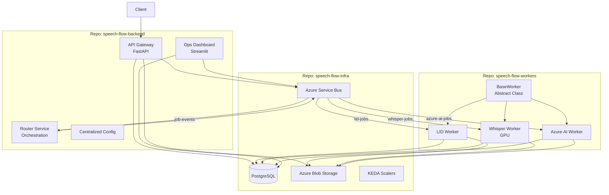

# Azure Event-Driven Speech Processing System: Technical Architecture

## 1. System Overview

This document outlines the architecture for a scalable, event-driven speech processing platform designed to run on Azure Kubernetes Service (AKS). The system is engineered to handle high-volume audio ingestion, intelligent routing, and parallel processing using both local GPU resources and Azure AI services.

**Key Goals:**
*   **Scalability:** Horizontal scaling of worker nodes based on queue depth using KEDA.
*   **Event-Driven:** Asynchronous communication via Azure Service Bus to decouple components.
*   **Hybrid Processing:** Utilization of cost-effective local models (Whisper V3 on GPU) alongside high-fidelity Azure AI services.
*   **Observability:** Real-time tracking of job lifecycles and worker health.
*   **Reliability:** Idempotent operations, graceful shutdown, and automatic retry with configurable limits.

## 2. Repository Strategy (Multi-Repo)

To facilitate parallel development by different teams (Platform, Backend, ML), the codebase is split into three logical repositories:

| Repository | Owner | Contents |
| :--- | :--- | :--- |
| **`speech-flow-infra`** | Platform / DevOps Team | Kubernetes manifests, Database Schemas, KEDA ScaledObjects, ConfigMaps. |
| **`speech-flow-backend`** | Backend Engineering Team | **API Gateway** (FastAPI), **Router Service** (Orchestration), **Ops Dashboard** (Streamlit), shared config and models. |
| **`speech-flow-workers`** | AI / ML Team | **LID Worker**, **Whisper Worker** (GPU), **Azure AI Worker**, **BaseWorker** abstract class. Focus on model inference and data processing. |

## 3. Architecture Diagram



## 4. Component Specifications

### 4.1 Repository: `speech-flow-backend`

#### A. API Gateway (FastAPI)
*   **Path:** `/api/main.py`
*   **Role:** Entry point for all client interactions.
*   **Key Features:**
    *   Generates SAS Tokens for direct-to-blob uploads
    *   Input validation using `Literal` types for workflow_type
    *   Workflow-specific validation (e.g., `transcribe_only` requires `source_language`)
    *   Results aggregation endpoint (`GET /jobs/{id}/results`)

**Endpoints:**
| Method | Path | Description |
|--------|------|-------------|
| POST | `/jobs` | Submit new job, returns SAS upload URL |
| POST | `/jobs/{id}/start` | Trigger processing after upload |
| GET | `/jobs/{id}` | Get job status with step details |
| GET | `/jobs/{id}/results` | Get aggregated results (transcript, translation, summary) |
| GET | `/jobs` | List jobs with filtering |
| DELETE | `/jobs/{id}` | Cancel a pending/queued job |

**Workflow Types (Validated via Literal):**
```python
Literal["full_pipeline", "transcribe_only", "lid_only", "translate_only", "summarize_only"]
```

#### B. Router Service
*   **Path:** `/router/main.py`
*   **Role:** Central orchestrator consuming `job-events` queue.
*   **Key Features:**
    *   Workflow state machine management
    *   Retry logic with configurable `MAX_RETRIES` (default: 3)
    *   Callback notifications on completion/failure
    *   Centralized queue name references from config

**Retry Logic:**
```python
if step.retry_count < MAX_RETRIES:
    step.retry_count += 1
    # Re-queue task
else:
    job.status = "failed"
    # Send failure callback
```

#### C. Operations Dashboard
*   **Path:** `/dashboard/app.py`
*   **Role:** Real-time visibility and monitoring.
*   **Tech:** Streamlit app with auto-refresh.
*   **Features:**
    *   Job statistics and status breakdown
    *   Service Bus queue depth monitoring
    *   Individual job drill-down
    *   Recent jobs table with status indicators

#### D. Centralized Configuration
*   **Path:** `/config.py`
*   **Role:** Single source of truth for all configuration.
*   **Contains:**
    *   Azure connection strings (from environment)
    *   Queue names: `JOB_EVENTS_QUEUE_NAME`, `LID_QUEUE_NAME`, `WHISPER_QUEUE_NAME`, `AZURE_AI_QUEUE_NAME`
    *   Container names: `AUDIO_CONTAINER_NAME`, `RESULTS_CONTAINER_NAME`

### 4.2 Repository: `speech-flow-workers`

#### A. BaseWorker (Abstract Class)
*   **Path:** `/common/base_worker.py`
*   **Role:** Reduces code duplication across all workers.
*   **Key Features:**
    *   **Idempotency:** Checks step status before processing to prevent duplicate work
    *   **Graceful Shutdown:** Handles SIGTERM/SIGINT signals for clean pod termination
    *   **Blob Operations:** Common methods for reading/writing to Azure Blob Storage
    *   **Database Operations:** Standardized step status updates

**Abstract Method:**
```python
@abstractmethod
def process(self, message_data: dict) -> dict:
    """Implement specific processing logic in subclass"""
    pass
```

**Idempotency Check:**
```python
def check_step_status(self, job_id: str, step_type: str) -> str:
    # Returns current status, skips if already 'completed' or 'processing'
```

#### B. LID Worker
*   **Path:** `/lid/worker.py`
*   **Role:** Language Identification.
*   **Model:** Facebook MMS (`facebook/mms-lid-126`)
*   **Inference:** CPU-based, lightweight
*   **Output:** Detected language code (e.g., "eng", "cmn", "yue")

#### C. Whisper Worker
*   **Path:** `/whisper/worker.py`
*   **Role:** Speech-to-text transcription.
*   **Model:** `faster-whisper` (CTranslate2 optimized)
*   **Inference:** GPU (CUDA) for Mandarin/Cantonese
*   **Output:** Full transcript with word-level timestamps

#### D. Azure AI Worker
*   **Path:** `/azure_ai/worker.py`
*   **Role:** Translation and Summarization.
*   **Service:** Azure OpenAI (GPT-4.1)
*   **Operations:**
    *   `TRANSLATE`: Non-English to English translation
    *   `SUMMARIZE`: Generate concise summary with key points

### 4.3 Repository: `speech-flow-infra`

#### A. Database Schema
*   **Path:** `/database/schema.sql`
*   **Tables:** `jobs`, `processing_steps`

#### B. Kubernetes Manifests
*   **Path:** `/k8s/`
*   **Files:**
    | File | Purpose |
    |------|---------|
    | `00-base.yaml` | Namespace, ConfigMaps, Secrets |
    | `01-postgres.yaml` | PostgreSQL StatefulSet |
    | `02-backend-api.yaml` | API Gateway Deployment + Service |
    | `03-backend-router.yaml` | Router Deployment |
    | `04-backend-dashboard.yaml` | Dashboard Deployment + Service |
    | `05-worker-lid.yaml` | LID Worker + KEDA ScaledObject |
    | `06-worker-whisper.yaml` | Whisper Worker (GPU) + KEDA ScaledObject |
    | `07-worker-azure.yaml` | Azure AI Worker + KEDA ScaledObject |

## 5. Workflow Definitions

### 5.1 Full Pipeline
```
LID → TRANSCRIBE → TRANSLATE (if non-English) → SUMMARIZE
```

### 5.2 Transcribe Only
```
TRANSCRIBE (requires source_language)
```

### 5.3 LID Only
```
LID
```

### 5.4 Translate Only
```
TRANSLATE (requires source_language, expects existing transcript)
```

### 5.5 Summarize Only
```
SUMMARIZE (requires source_language, expects existing transcript)
```

## 6. Data Flow: "Full Pipeline" Request

```
┌─────────┐     ┌─────────┐     ┌─────────────┐     ┌─────────────┐
│ Client  │────▶│   API   │────▶│ Blob Storage│     │  PostgreSQL │
└─────────┘     └─────────┘     └─────────────┘     └─────────────┘
                     │                                      ▲
                     ▼                                      │
              ┌─────────────┐                               │
              │ Service Bus │                               │
              │ (job-events)│                               │
              └─────────────┘                               │
                     │                                      │
                     ▼                                      │
              ┌─────────────┐                               │
              │   Router    │───────────────────────────────┤
              └─────────────┘                               │
                     │                                      │
         ┌──────────┼──────────┐                           │
         ▼          ▼          ▼                           │
    ┌─────────┐ ┌─────────┐ ┌─────────┐                   │
    │   LID   │ │ Whisper │ │Azure AI │───────────────────┘
    │  Worker │ │  Worker │ │  Worker │
    └─────────┘ └─────────┘ └─────────┘
```

**Step-by-step:**
1. **Submit:** Client `POST /jobs` → API creates job record, returns SAS URL
2. **Upload:** Client uploads audio directly to Blob Storage using SAS URL
3. **Start:** Client `POST /jobs/{id}/start` → API sends message to `job-events` queue
4. **Route:** Router consumes message, creates LID step, sends to `lid-jobs` queue
5. **LID:** LID Worker processes audio, detects language, updates DB, sends completion event
6. **Route:** Router sees LID complete, creates TRANSCRIBE step, routes to `whisper-jobs`
7. **Transcribe:** Whisper Worker transcribes audio (GPU), saves to blob, updates DB
8. **Route:** Router sees TRANSCRIBE complete, routes to Azure AI for translation
9. **Translate:** Azure AI Worker translates (if non-English), saves result
10. **Route:** Router routes to Azure AI for summarization
11. **Summarize:** Azure AI Worker generates summary, saves result
12. **Complete:** Router marks job as completed, sends callback (if configured)
13. **Results:** Client `GET /jobs/{id}/results` → API aggregates all results from blob

## 7. Database Schema (PostgreSQL)

*Located in `speech-flow-infra/database/schema.sql`*

```sql
-- Jobs table
CREATE TABLE jobs (
    id UUID PRIMARY KEY DEFAULT gen_random_uuid(),
    audio_filename VARCHAR(255) NOT NULL,
    workflow_type VARCHAR(50) NOT NULL,
    source_language VARCHAR(10),
    target_language VARCHAR(10) DEFAULT 'en',
    callback_url TEXT,
    status VARCHAR(20) NOT NULL DEFAULT 'pending_upload',
    created_at TIMESTAMP WITH TIME ZONE DEFAULT NOW(),
    updated_at TIMESTAMP WITH TIME ZONE DEFAULT NOW()
);

-- Processing steps table
CREATE TABLE processing_steps (
    id UUID PRIMARY KEY DEFAULT gen_random_uuid(),
    job_id UUID NOT NULL REFERENCES jobs(id) ON DELETE CASCADE,
    step_type VARCHAR(50) NOT NULL,
    status VARCHAR(20) NOT NULL DEFAULT 'pending',
    worker_id VARCHAR(100),
    started_at TIMESTAMP WITH TIME ZONE,
    completed_at TIMESTAMP WITH TIME ZONE,
    result_blob_path TEXT,
    error_message TEXT,
    retry_count INTEGER DEFAULT 0,
    created_at TIMESTAMP WITH TIME ZONE DEFAULT NOW()
);

-- Indexes for performance
CREATE INDEX idx_jobs_status ON jobs(status);
CREATE INDEX idx_steps_job_id ON processing_steps(job_id);
CREATE INDEX idx_steps_status ON processing_steps(status);
```

**Job Statuses:**
- `pending_upload` - Waiting for audio file upload
- `queued` - Submitted for processing
- `processing` - Currently being processed
- `completed` - All steps finished successfully
- `partial_complete` - Some steps completed, some failed
- `failed` - Processing failed after max retries
- `cancelled` - Cancelled by user

**Step Statuses:**
- `pending` - Waiting to start
- `processing` - Currently executing
- `completed` - Finished successfully
- `failed` - Failed (may retry)

## 8. Reliability Patterns

### 8.1 Idempotency
Workers check step status before processing:
```python
status = self.check_step_status(job_id, step_type)
if status in ['completed', 'processing']:
    return  # Skip duplicate processing
```

### 8.2 Retry Logic
Router implements automatic retry with exponential backoff potential:
```python
MAX_RETRIES = 3

if step.status == 'failed' and step.retry_count < MAX_RETRIES:
    step.retry_count += 1
    step.status = 'pending'
    # Re-queue task
```

### 8.3 Graceful Shutdown
BaseWorker handles termination signals:
```python
signal.signal(signal.SIGTERM, self._handle_shutdown)
signal.signal(signal.SIGINT, self._handle_shutdown)

# Allows current message to complete before exiting
```

### 8.4 Callbacks
Optional webhook notifications on job completion:
```python
if callback_url:
    requests.post(callback_url, json={
        "job_id": job_id,
        "status": "completed",
        "results_url": f"/jobs/{job_id}/results"
    })
```

## 9. Infrastructure & Scaling

### 9.1 Node Pools
| Pool | Purpose | Instance Type |
|------|---------|---------------|
| `system` | AKS system pods | Standard_DS2_v2 |
| `default` | Backend services, LID worker | Standard_D4s_v3 |
| `gpu` | Whisper worker | Standard_NC6s_v3 (GPU) |

### 9.2 KEDA Scaling
Each worker has a `ScaledObject` targeting its queue:
```yaml
triggers:
  - type: azure-servicebus
    metadata:
      queueName: lid-jobs
      messageCount: "5"  # Scale up when > 5 messages
```

### 9.3 Resource Limits
| Component | CPU Request | Memory Request | GPU |
|-----------|-------------|----------------|-----|
| API Gateway | 100m | 256Mi | - |
| Router | 100m | 256Mi | - |
| Dashboard | 100m | 256Mi | - |
| LID Worker | 500m | 1Gi | - |
| Whisper Worker | 1000m | 4Gi | 1 |
| Azure AI Worker | 200m | 512Mi | - |

## 10. Configuration Reference

### Environment Variables
| Variable | Description | Used By |
|----------|-------------|---------|
| `DATABASE_URL` | PostgreSQL connection string | All backend services |
| `SERVICE_BUS_CONNECTION_STRING` | Azure Service Bus connection | All services |
| `AZURE_STORAGE_CONNECTION_STRING` | Blob Storage connection | API, Workers |
| `AZURE_OPENAI_ENDPOINT` | Azure OpenAI endpoint | Azure AI Worker |
| `AZURE_OPENAI_API_KEY` | Azure OpenAI API key | Azure AI Worker |
| `AZURE_OPENAI_DEPLOYMENT` | GPT-4.1 deployment name | Azure AI Worker |

### Queue Names (Centralized in config.py)
| Constant | Value | Purpose |
|----------|-------|---------|
| `JOB_EVENTS_QUEUE_NAME` | `job-events` | Job lifecycle events |
| `LID_QUEUE_NAME` | `lid-jobs` | Language identification tasks |
| `WHISPER_QUEUE_NAME` | `whisper-jobs` | Transcription tasks |
| `AZURE_AI_QUEUE_NAME` | `azure-ai-jobs` | Translation/Summarization tasks |

### Container Names
| Constant | Value | Purpose |
|----------|-------|---------|
| `AUDIO_CONTAINER_NAME` | `audio-files` | Uploaded audio files |
| `RESULTS_CONTAINER_NAME` | `results` | Processing results (JSON) |

## 11. Implementation Status

### Completed ✅
- [x] API Gateway with all endpoints including results aggregation
- [x] Router Service with retry logic and callbacks
- [x] Operations Dashboard with real-time monitoring
- [x] LID Worker with Facebook MMS model
- [x] Whisper Worker with faster-whisper (GPU support)
- [x] Azure AI Worker for translation and summarization
- [x] BaseWorker abstract class with idempotency and graceful shutdown
- [x] Database schema with retry_count support
- [x] Kubernetes manifests with KEDA scaling
- [x] Input validation with Literal types
- [x] Centralized configuration

### Future Enhancements 📋
- [ ] Add health check endpoints to workers
- [ ] Implement distributed tracing (OpenTelemetry)
- [ ] Add Prometheus metrics
- [ ] Implement dead-letter queue handling
- [ ] Add authentication/authorization
- [ ] Implement rate limiting
- [ ] Add audio format validation
- [ ] Implement job priority queues
